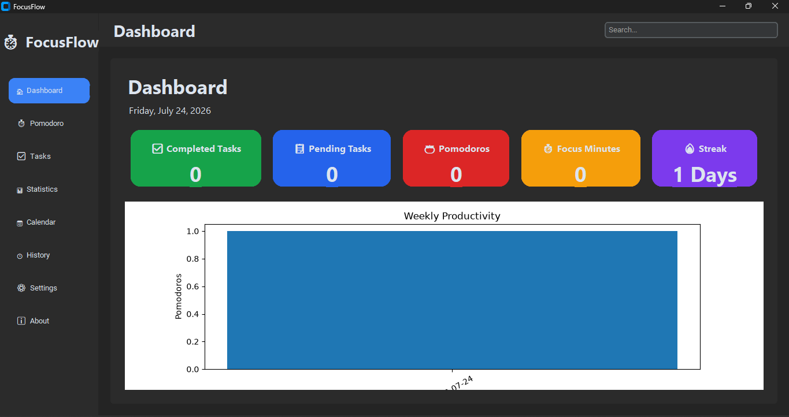
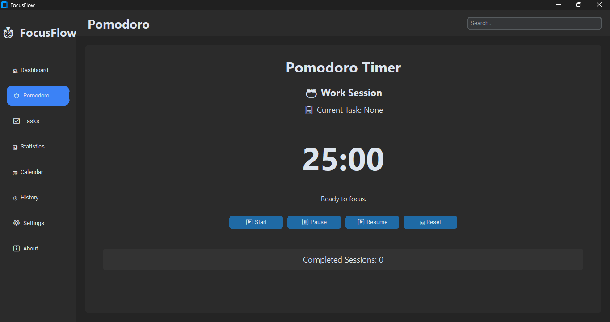
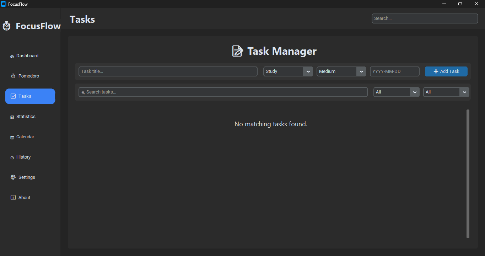
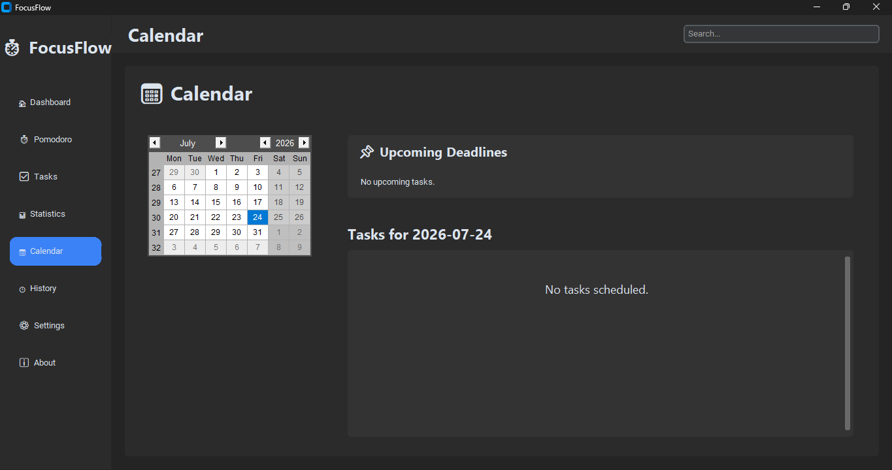
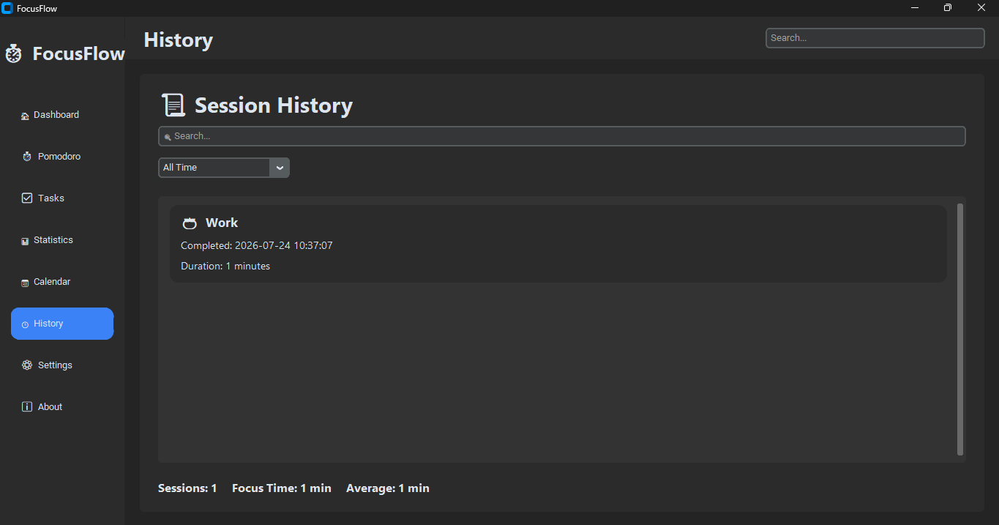
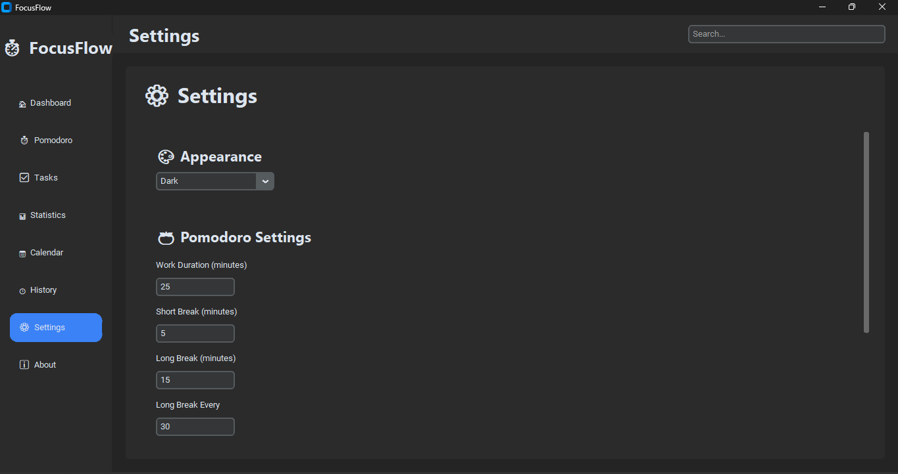

# 🍅 FocusFlow


A **Python-based Pomodoro productivity application** designed to help students and professionals improve focus, manage tasks, and build productive work habits using the Pomodoro Technique.

FocusFlow combines time management, task organization, productivity analytics, calendar scheduling, AI-powered insights, and customizable settings into one modern desktop application.

---

# 🖥️ Application Preview

<table>
  <tr>
    <td align="center">
      
      <br>
      <b>Dashboard</b>
    </td>
    <td align="center">
      
      <br>
      <b>Pomodoro Timer</b>
    </td>
  </tr>

  <tr>
    <td align="center">
      
      <br>
      <b>Task Manager</b>
    </td>
    <td align="center">
      
      <br>
      <b>Statistics Overview</b>
    </td>
  </tr>

  <tr>
    <td align="center">
      
      <br>
      <b>Statistics Analytics</b>
    </td>
    <td align="center">
      
      <br>
      <b>Calendar</b>
    </td>
  </tr>

  <tr>
    <td align="center">
      
      <br>
      <b>Session History</b>
    </td>
    <td align="center">
      
      <br>
      <b>Settings</b>
    </td>
  </tr>

  <tr>
    <td align="center">
      
      <br>
      <b>About (Overview)</b>
    </td>
    <td align="center">
      
      <br>
      <b>About (Developer Information)</b>
    </td>
  </tr>
</table>

---

# 📌 Overview

FocusFlow is a desktop productivity application developed using **Python** and **CustomTkinter**.

It is built around the **Pomodoro Technique**, enabling users to stay focused, organize daily tasks, monitor productivity, and analyze work patterns through interactive dashboards and statistics.

The application is designed to promote effective time management while providing a clean, intuitive, and modern user experience.

---

# ✨ Features

✅ Customizable Pomodoro Timer

✅ Task Management System

✅ Productivity Dashboard

✅ Interactive Statistics & Charts

✅ Calendar-Based Task Planner

✅ Session History Tracking

✅ AI Productivity Insights

✅ Achievement & Streak Tracking

✅ Light/Dark Mode Support

✅ Custom Notification Settings

✅ SQLite Database Storage

✅ Desktop Application built with CustomTkinter

---

# 🛠️ Technologies Used

## Programming Language

* Python 3.x

## GUI Framework

* CustomTkinter

## Database

* SQLite

## Data Visualization

* Matplotlib

## Calendar

* TkCalendar

## Libraries

* `sqlite3`
* `datetime`
* `matplotlib`
* `tkcalendar`
* `Pillow`
* `os`
* `json`

## Development Tools

* PyCharm
* PyInstaller

---

# 🚀 Installation

## 1. Clone the repository

```bash
git clone https://github.com/rheillunio2-byte/FocusFlow.git
```

## 2. Navigate to the project

```bash
cd FocusFlow
```

## 3. Install dependencies

```bash
pip install -r requirements.txt
```

## 4. Run the application

```bash
python app.py
```

---

# 📖 How It Works

1. Create and organize daily tasks.
2. Start a Pomodoro focus session.
3. Complete work and break cycles.
4. Sessions are automatically saved.
5. Productivity statistics are generated.
6. AI analyzes your productivity patterns.
7. Calendar and History keep track of your progress over time.

---

# 📊 Core Modules

* 🍅 Pomodoro Timer
* ✅ Task Manager
* 📊 Statistics
* 📅 Calendar
* 📜 History
* 🤖 AI Insights
* ⚙️ Settings
* ℹ️ About

---

# 📂 Project Structure

```text
FocusFlow/
│
├── app.py
├── database/
│   └── focusflow.db
│
├── services/
│
├── ui/
│
├── assets/
│
├── Images/
│   ├── Dashboard
│   ├── Pomodoro
│   ├── Tasks
│   ├── Statistics
│   ├── Calendar
│   ├── History
│   ├── Settings
│   └── About
│
├── README.md
├── LICENSE
└── requirements.txt
```

---

# 📈 Productivity Features

* Daily Focus Tracking
* Weekly Productivity Charts
* Monthly Productivity Trends
* Category Distribution Charts
* Session History
* Current Streak Tracking
* Achievement System
* AI-Based Productivity Recommendations

---

# 🔮 Future Improvements

Planned features include:

* Cloud synchronization
* User accounts
* Focus music integration
* Desktop notifications
* Mobile companion app
* Team productivity dashboard
* AI-generated weekly productivity reports
* Goal tracking and habit analytics
* Export statistics to PDF and Excel

---

# 👨‍💻 Developer

**Rheil Evans T. Lunio**

Computer Science Student

University of Science and Technology of Southern Philippines (USTP)

---

# 🤝 Contributing

Contributions, suggestions, and improvements are welcome!

Please read the **CONTRIBUTING.md** guide before submitting pull requests or feature requests.

---

# 📄 License

This project is licensed under the **MIT License**. See the [LICENSE](https://github.com/rheillunio2-byte/PomodoroPA/blob/main/LICENSE) file for more details.
